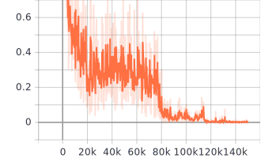
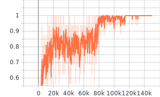
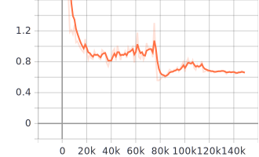
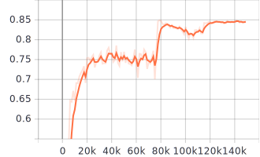

# DGNN-PyTorch

An unofficial PyTorch implementation of the paper "Skeleton-Based Action Recognition with Directed Graph Neural Networks" in CVPR 2019.

- Paper: [PDF](http://openaccess.thecvf.com/content_CVPR_2019/papers/Shi_Skeleton-Based_Action_Recognition_With_Directed_Graph_Neural_Networks_CVPR_2019_paper.pdf)
- Code is based on 2s-AGCN: [GitHub](https://github.com/lshiwjx/2s-AGCN)

## Dependencies

- Python >= 3.5
- scipy >= 1.3.0
- numpy >= 1.16.4
- PyTorch >= 1.1.0
- tensorboardX >= 1.8   (For logging)

## Directory Structure

Most of the interesting stuff can be found in:
- `model/dgnn.py`: model definition of DGNN
- `data_gen/`: how raw datasets are processed into numpy tensors
- `graphs/directed_ntu_rgb_d.py`: graph definition for DGNN
- `feeders/feeder.py`: how datasets are read in
- `main.py`: general training/eval processes; graph freezing by disabling gradients; etc.

## Downloading & Generating Data

### NTU RGB+D

1. The [NTU RGB+D dataset](https://www.cv-foundation.org/openaccess/content_cvpr_2016/papers/Shahroudy_NTU_RGBD_A_CVPR_2016_paper.pdf) can be downloaded from [here](http://rose1.ntu.edu.sg/Datasets/actionRecognition.asp). We'll only need the Skeleton data (~ 5.8G).

2. After downloading, unzip it and put the folder `nturgb+d_skeletons` to `./data/nturgbd_raw/`.

3. Generate the joint dataset first:

```bash
cd data_gen
python3 ntu_gen_joint_data.py
```

Specify the data location if the raw skeletons data are placed somewhere else. The default looks at `./data/nturgbd_raw/`.

4. Then, in `data_gen/`, generate the bone dataset:

```bash
python3 ntu_gen_bone_data.py
```

5. Finally, generate the motion data from joints/bones:

```bash
python3 ntu_gen_motion_data.py
```

The generation scripts look for generated data in previous step. By default they look at `./data`; change dir configs if needed.

### Kinetics

(**Currently, generating bone/motion data from Kinetics skeletons is not yet supported. Please feel free to add scripts based on `kinetics_gendata.py`**)

1. Download the Kinetics dataset from ST-GCN repo (https://github.com/yysijie/st-gcn)
2. Generate joint data:

```bash
cd data_gen
python3 kinetics_gendata.py
```

3. Generate bone data: TODO, feel free to fork/submit PR :D
4. Generate motion data: TODO, feel free to fork/submit PR :D


## Training

### 1st Stream: Spatial

To start training the network with the spatial stream, use the following command:

```bash
python3 main.py --config ./config/<dataset>/train_spatial.yaml
```

Here, `<dataset>` should be one of `nturgbd-cross-subject`, `nturgbd-cross-view`, or `kinetics-skeleton` depending on the dataset/task on which to train the model.

**Note:** At the moment, only `nturgbd-cross-subject` is supported. More config files will (hopefully) be added, or you could write your own config file using the existing ones for `nturgbd-cross-subject`.

### 2nd Stream: Motion

Similarly, to train on the motion stream data, do:

```bash
python3 main.py --config ./config/nturgbd-cross-subject/train_motion.yaml
```

and change the config file path for other datasets if needed.

## Testing

### Test individual streams

To test some model weights (by default saved in `./runs/`), do:

```bash
python3 main.py --config ./config/<dataset>/test_spatial.yaml
```

Similarly, change the paths in config file, or change the config files (`<dataset>`) for different datasets as needed.

### Ensemble results

Combine the generated scores with:

```bash
python ensemble.py --datasets <dataset>
```

where `<dataset>` is one of `kinetics`, `ntu/xsub`, `ntu/xview`

## Results

(**Unfortunately, due to hardware limits, I won't be able to reproduce more results on more datasets apart from the NTU RGB+D Cross Subject task**)

### NTU RGB+D Cross Subject

#### Hyperparameters

| Hyperparameter | Value | Notes |
| --- | --- | --- |
| Epochs | 120 | |
| Batch Size | 32 | Due to memory limit, each forward pass uses BS 16 and every gradient step takes 2 forward/backward passes |
| Optimizer | SGD + Nesterov Momentum | |
| Base LR | 0.1 | |
| LR Schedule | 0.1x at Epoch 60, 90 | |
| Weight Decay | 0.0005 | Value not found in the paper |
| # Epochs to freeze graphs | 10 | Graphs become learnable after 10 epochs by allowing gradients |

#### Summary

| | Test Accuracy (Reproduced) | Test Accuracy (In Paper)
| --- | --- | --- |
| Spatial Stream | 84.9% | 89.2% |
| Motion Stream | - | 86.8% |
| Ensemble (two-stream) | - | 89.9% |

#### Spatial Stream

*Training Loss and Accuracy*

<p align="center">
  
  
</p>

*Testing Loss and Accuracy*

<p align="center">
  
  
</p>

## TODO

- Kinetics
    - Handling datasets
    - Config files
